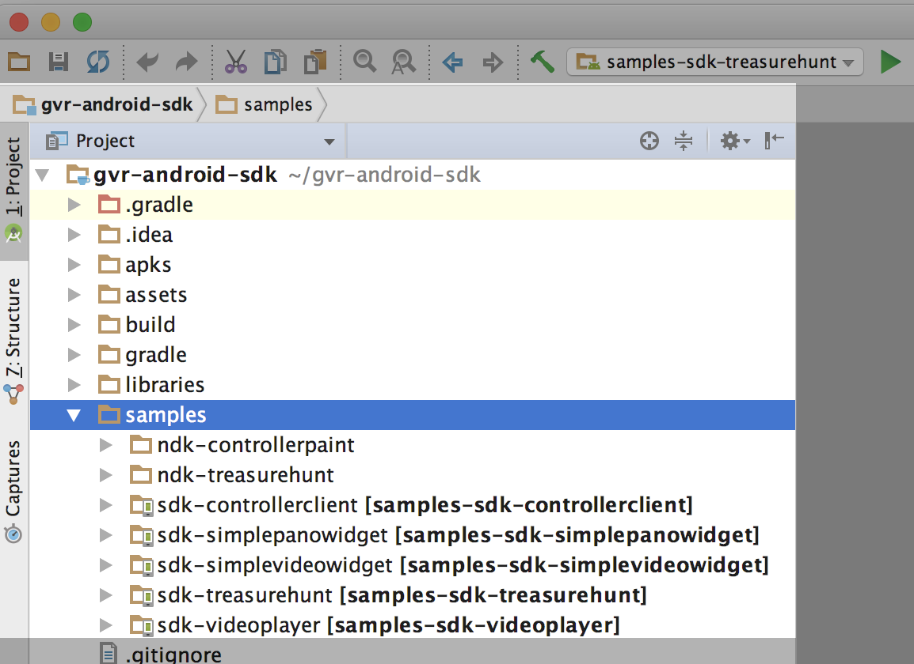

# 开始使用适用于Android的Google VR SDK

如果你使用Google VR SDK构建Daydream和VR眼镜应用程序，本指南将教会你如何设置Android Studio进行Google VR开发，以及如何使用Treasure Hunt示例应用程序。

## 设置开发环境

硬件要求：

* **开发Daydream应用：**你需要一款[支持Daydream的手机](//vr.google.com/daydream/smartphonevr/phones/)和[Daydream View VR眼镜](//madeby.google.com/vr/)。

* **开发VR眼镜应用：** 您需要安装Android 4.4“Kit Kat”（第19版API）或更高版本的Android设备和[VR眼镜](//vr.google.com/cardboard/get-cardboard/)。

软件要求：

* [Android Studio](//developer.android.com/studio/index.html)2.3.3或更高版本。

* Android SDK 7.1.1“牛轧糖”（第25版API）或更高版本。在Android Studio中，点击**首选项** > **外观和行为** > **系统设置** > **Android SDK**可查看或更新已安装的SDK。

* [Android版Google VR SDK](//github.com/googlevr/gvr-android-sdk/releases)1.80.0版本或更高版本。

## 在Android Studio中打开已有Goog​​le VR SDK项目

1. 下载Google VR SDK并解压至你想安装SDK的位置。

2. 打开Android Studio并选择**打开现有的Android Studio项目**，选择您解压缩Google VR SDK的目录。

3. 在**项目**窗口中，查看**gvr-android-sdk** > **样本**中的示例gradle模块：



| 示例名称 | 描述 |
|--------------------|-------------------------------------------------------------------------------------------|
| sdk-treasurehunt | 在该VR示例中，你可以完成收集方块的动作。 |
| sdk-controllerclient | 该示例将演示如何接收和处理Daydream控制器的输入 |
| sdk-simplepanowidget | 教会你如何使用组件来加载全景图像 |
| sdk-simplevideowidget | 教会你如何使用组件来渲染一组全景视频 |
| sdk-videoplayer | 该示例将演示如何使用Asynchronous Reprojection Video Surface API来播放视频。了解更多相关信息，请参阅Google VR NDK指南中的[使用视频视口](//developers.google.com/vr/android/ndk/gvr-ndk-rendering#using_video_viewports)。 |

## 设置硬件设备

* [启用开发人员选项](//developer.android.com/studio/debug/dev-options.html#enable)

* [启用USB调试模式](//developer.android.com/studio/debug/dev-options.html#debugging)

## 构建并运行示例应用

1. 使用USB线将手机连接到电脑。

2. 在Android Studio中，选择**运行** > **运行...**，然后选择**samples-sdk-treasurehunt**目标，即可让Android Studio在手机上编译并运行应用程序。

3. 将手机放入VR眼镜就可以开始体验这个VR应用了。

    * 转转头可以看到大型立方体。

    * 如果你是使用**Daydream设备：** 可以将控制器指向立方体，这时按下触摸板按钮就能拾起它。

    * 如果你是使用**VR眼镜** 可以看向立方体，让视线落在上面，这时按下VR眼镜上的按钮就能拾起它。

    * 再按一下钮按，可以将立方体放下，从而完成移动立方体的动作。


“寻宝”应用程序演示了Google VR SDK的以下核心特性：

| 特性                | 描述                                                                                      |
|------------------------|--------------------------------------------------------------------------------------------------|
| 立体渲染       | 应用程序视图通过立体声呈现3D效果                                          |
| 空间音频          | 声音来自VR世界的不同方向，增强现实感                        |
| 头部移动跟踪 | 在VR世界中，用户转头时，系统会根据头部的转动更新用户所见画面，这样用户就能看到四面八方的场景了 |
| 交互操作             | 用户可以使用Daydream控制器或VR眼镜上的按钮与VR应用程序进行交互                 |

了解更多详细信息，请参阅[寻宝示例演示](https://developers.google.com/vr/android/samples/treasure-hunt)。

## 在您自己的项目中使用Google VR

要在自己的项目中使用Google VR SDK或NDK，请安装好Google VR的依赖包。如果您在应用程序中使用了[ProGuard](//developer.android.com/studio/build/shrink-code.html)，请添加规则，以确保它不会和任何SDK或NDK代码混淆。

### 设置Google VR相关依赖

1. 配置您的项目级别*build.gradle*文件：

    * 确保声明好默认的`jcenter()`仓库位置。

    * 声明以下任一Android Gradle插件依赖：


        对于 **Google VR SDK项目**：使用`gradle:2.3.3`或更高版本。

        对于 **Google VR NDK项目**：使用`gradle-experimental:0.9.3`或更高版本。
```
allprojects {        
    repositories {
        jcenter()
    }
}
dependencies {
    // 需要安装Google VR SDK 2.3.3或更高版本。            
    classpath 'com.android.tools.build:gradle:2.3.3'       

    // 需要安装Google VR NDK 0.9.3实验版或更高版本。            
    classpath 'com.android.tools.build:gradle-experimental:0.9.3'
}
```

2. 在您的模块级别*build.gradle*文件中添加Google VR SDK库依赖项。可以在**gvr-android-sdk** > **库**中查看可用的库及其版本。

    As an example, review the `dependencies` declared for the Treasure Hunt app in **gvr-android-sdk** > **samples** > **sdk-treasurehunt** > *build.gradle*.

    例如，点击**gvr-android-sdk** > **samples** > **sdk-treasurehunt** > *build.gradle*查看为“treasurehunt”应用程序声明的“依赖关系”。
```
dependencies {
    // 添加Google VR空间音频支持        
    compile 'com.google.vr:sdk-audio:1.80.0'      

    // Google VR应用程式都必需安装此库
    compile 'com.google.vr:sdk-base:1.80.0'     
}
```
    要了解更多相关信息，请参阅Android Studio指南中的[添加构建依赖关系](//developer.android.com/studio/build/dependencies.html)。

### 配置ProGuard

如果您正在使用[ProGuard](//developer.android.com/studio/build/shrink-code.html)来压缩应用的APK文件，请确保ProGuard源码不会和Google VR SDK或NDK源码产生混淆，这样有利于调试跟踪。

Add the Google VR ProGuard [proguard-gvr.txt](//github.com/googlevr/gvr-android-sdk/blob/master/proguard-gvr.txt) rules to your module level *build.gradle* file:

将Google VR ProGuard [proguard-gvr.txt]（// github.com/googlevr/gvr-android-sdk/blob/master/proguard-gvr.txt）规则添加到您的模块级别*build.gradle*文件中：
```
android {
    ...    
    buildTypes {
        release {
            minifyEnabled true
            proguardFiles.add(file('../../proguard-gvr.txt'))
        }
    }
}
```

## 下一步

要了解更多有关Google VR SDK的信息，请参阅以下资源。

* [寻宝示例代码演示](https://developers.google.com/vr/android/samples/treasure-hunt)

* [Google VR SDK视频和全景图像示例应用程序演示](https://developers.google.com/vr/android/samples/vrview)

* 了解更多[Daydream元素](https://developers.google.com/vr/elements/overview)中的Google VR设计和开发原则。

* [Android的空间音频教程](https://developers.google.com/vr/android/spatial-audio)

* [Google VR API参考](https://developers.google.com/vr/android/reference_overview)

* **Daydream:** 进一步了解如何在您的应用程序中实现Daydream控制器用户交互：

    * 点击 **gvr-android-sdk ** > **库** > **sdk-controller**，查看控制器库。

    * 另请参阅[控制器库API参考](https://developers.google.com/vr/android/reference/com/google/vr/sdk/controller/package-summary)。

版权所有，翻印必究。Java是隶属于Oracle及旗下产品注册商标。

最后更新时间：2017年9月8日